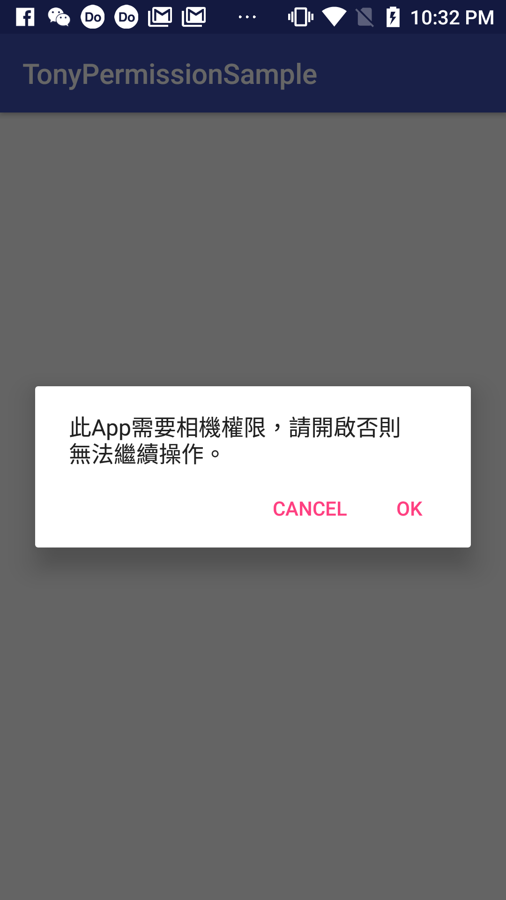

# TonyPermissionSample

這是一個關於Android permission處理的簡單範例。

在AndroidDeveloperBlog的[這篇文章](https://android-developers.googleblog.com/2017/12/improving-app-security-and-performance.html)提到了Google他們想要改善Google play的app安全性和效能所做的新規範，其中有關於target version的要求。

  * August 2018: New apps required to target API level 26 (Android 8.0) or higher.
  * November 2018: Updates to existing apps required to target API level 26 or higher.
  * 2019 onwards: Each year the targetSdkVersion requirement will advance. Within one year following each Android dessert release, new apps and app updates will need to target the corresponding API level or higher.

這意味著我們不能用較低的target version避開繁瑣權限處理的部份，這部分所有的App都必須正視它。

會這麼說是因為Android權限處理在Android 6.0以前，開發者只需要在manifest設定app所需要的權限，會向使用者要求所有權限後才能安裝。

從Android 6.0之後的版本，除了安裝時會向使用者索取權限詢問使用者是否同意之外，還需「即時」詢問使用者是否同意開啟某個權限，這對於開發者來說處理權限問題會是個麻煩的事情，還好Google推出了[easypermissions](https://github.com/googlesamples/easypermissions)函式庫，大大減少了繁瑣的權限處理問題。

## 安裝

在rootProject底下的build.gradle設定dependencies

```groovy
dependencies {
    implementation 'pub.devrel:easypermissions:1.2.0'
}
```

## 使用方式

### 使用EasyPermissions處理權限要求 

這段code是將permission處理交給EasyPermissions 

```java
@Override
public void onRequestPermissionsResult(int requestCode, String[] permissions, int[] grantResults) {
    super.onRequestPermissionsResult(requestCode, permissions, grantResults);

    // Forward results to EasyPermissions
    EasyPermissions.onRequestPermissionsResult(requestCode, permissions, grantResults, this);
}
```

### 向使用者要求權限

在這裡向使用者即時要求CAMERA權限

```java
@AfterPermissionGranted(RC_CAMERA)
private void cameraPermissionTask() {
    String[] perms = {Manifest.permission.CAMERA};
    if (EasyPermissions.hasPermissions(this, perms)) {
        // Already have permission, do the thing
    } else {
        // Do not have permissions, request them now
        EasyPermissions.requestPermissions(this, getString(R.string.need_camera_permission_description),
                RC_CAMERA, perms);
    }
}
```

在使用者拒絕PermissionDialog至少一次時，會出現RationaleDialog，如下圖：



為了更好控制權限要求的流程，會讓Fragment/Activity實現“PermissionCallbacks“介面

```java
public class MainActivity extends AppCompatActivity implements EasyPermissions.PermissionCallbacks {

    @Override
    protected void onCreate(Bundle savedInstanceState) {
        super.onCreate(savedInstanceState);
        setContentView(R.layout.activity_main);
    }

    @Override
    public void onRequestPermissionsResult(int requestCode, String[] permissions, int[] grantResults) {
        super.onRequestPermissionsResult(requestCode, permissions, grantResults);

        // Forward results to EasyPermissions
        EasyPermissions.onRequestPermissionsResult(requestCode, permissions, grantResults, this);
    }

    @Override
    public void onPermissionsGranted(int requestCode, List<String> list) {
        // Some permissions have been granted
        // ...
    }

    @Override
    public void onPermissionsDenied(int requestCode, List<String> list) {
        // Some permissions have been denied
        // ...
    }
}
```

### 必須的權限

onPermissionsDenied方法用來處理使用者拒絕權限要求的事情

```java
@Override
public void onPermissionsDenied(int requestCode, @NonNull List<String> perms) {
    Log.d(TAG, "onPermissionsDenied:" + requestCode + ":" + perms.size());

    // (Optional) Check whether the user denied any permissions and checked "NEVER ASK AGAIN."
    // This will display a dialog directing them to enable the permission in app settings.
    if (EasyPermissions.somePermissionPermanentlyDenied(this, perms)) {
        new AppSettingsDialog.Builder(this).build().show();
    }
}
```

當使用者拒絕這個權限要求時，會呼叫onPermissionsDenied方法，如果拒絕權限的同時又勾選「不再詢問我(Don't ask again)」，那麼下方的EasyPermissions.somePermissionPermanentlyDenied(this, perms)就會成立，這裡會將使用者導向系統的App Setting頁面。
